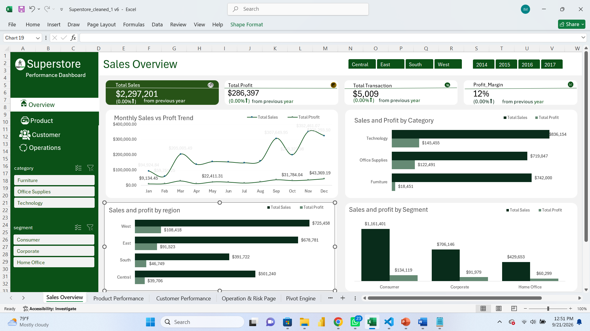
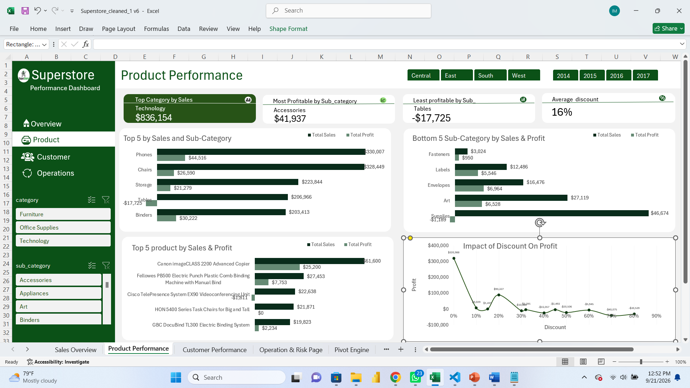
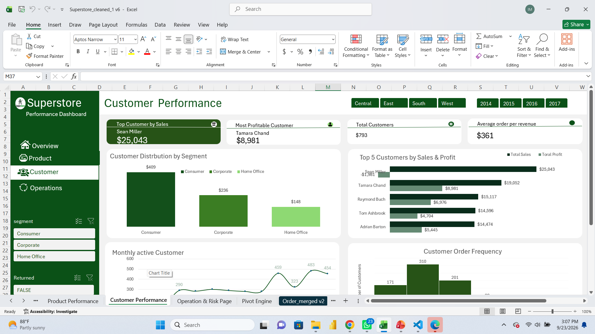
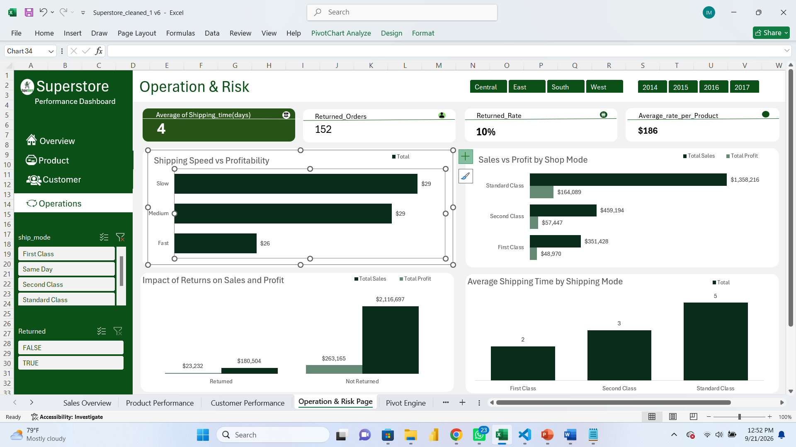

# SuperStore Sales Performance Analysis

## Project Overview

This project provides an interactive sales performance analysis for SuperStore. It evaluates overall financial health, regional and category revenue drivers, discounting impacts, customer behavior, and fulfillment risk. The primary tool used to clean, model, aggregate, and visualize the data is Microsoft Excel.

## Business Problem

SuperStore faces strategic challenges in identifying key drivers of profitability across regions, product categories, customer segments, and shipping operations. Without clear visual metrics, sub-category margin loss and fulfillment inefficiencies risk eroding overall profit.

Project Objective: Evaluate sales, profit, and operational data to pinpoint performance drivers, identify unprofitable product lines and operational bottlenecks, and provide actionable recommendations for margin optimization.

## Business Questions

The analysis addresses four core operational and strategic questions:

* **Overall & Regional Performance:** How are sales, profit, profit margin, and orders performing across time, regions, categories, and customer segments?

* **Product & Discounting Impact:** Which categories, sub-categories, and products generate the strongest and weakest results, and how do discounts affect overall profit?

* **Customer Dynamics:** Which customer segments and individual customers generate the highest value, and how active are they over time?

* **Fulfillment & Operations:** How do shipping speed, ship mode, and returned orders affect sales, profit, and service performance?

## Tools and Skills

### Software

* Microsoft Excel

### Data Visualization & Dashboard Design

* PivotTable Data Aggregation

* PivotChart Visualization

* Slicer Controls & Filter Connections

* Executive Scorecard Design

* Custom Navigation Controls

## Dataset

* **Source:** SuperStore dataset (`Superstore cleaned 1 v6`)

* **Time Period Covered:** 2014–2017

* **Total Transactions:** 5,009 orders

* **Total Customers:** 793 active customers

* **Key Fields & Dimensions:** Category, Sub-Category, Region, Segment, Ship Mode, Shipping Speed, Discount, Sales, Profit, Customer Name, Return Status

* **Geographic Coverage:** Regional breakdown across Central, East, South, and West

* **Data Limitations:** The dataset provides high-level order details, but specific cost-of-goods-sold (COGS) breakdowns and itemized return reasons are not recorded.

## Data Preparation and Analysis

Data preparation and underlying analytics were structured using a dedicated engine sheet and structured formulas:

* **Data Cleaning:** Cleaned in Excel (`Superstore cleaned 1 v6`) to standardise entries, remove errors, and format data types.

* **Pivot Engine:** A dedicated tab named `Pivot Engine` was constructed to house underlying PivotTables and summary aggregations.

* **Calculated Metrics:** Summary metrics were modeled to evaluate key indicators, including:
* Top-line Revenue: Total aggregated sales.

* Net Bottom-Line Profit: Total profit generated.

* Profit Margin Percentage: Derived as $\text{Net Profit} / \text{Total Revenue}$.

* Average Order Value (AOV): Derived as $\text{Total Revenue} / \text{Total Orders}$.

* Return Rate Percentage: Calculated against total orders.

## Dashboard Development

An interactive, multi-page executive dashboard was built in Microsoft Excel using PivotTables, PivotCharts, and timeline slicers.

* **KPI Scorecards:** Display top-level summary metrics (Revenue, Profit, Profit Margin, Transactions, AOV).

* **Slicers:** Slicers for Region (`Central`, `East`, `South`, `West`), Year (`2014`, `2015`, `2016`, `2017`), Category, Segment, Ship Mode, and Returned Status enable dynamic filtering across all pages.

* **Navigation:** Sidebar navigation buttons link across analysis pages.

## Dashboard Features

* **Interactive Region & Year Slicers:** Allows instant filtering of all visuals by region and time frame.

* **Category & Segment Filtering:** Side slicers enable deep dives into specific product sectors and customer groups.

* **Custom Visual Navigation:** Dedicated sidebar buttons facilitate clear switching between analytical views.

* **KPI Scorecards:** Header cards reflect dynamically updated metrics and totals based on active slicer selections.

## Dashboard Pages

### Sales Overview

Analyses overall financial health, historical trend trajectories, regional profit distribution, and main category revenue driver. 

### Product Performance

Evaluates product-level margins, top/bottom sub-categories, product sales rank, and the impact of discount levels on gross margin.

### Customer Performance
Focuses on customer segment behavior, purchasing frequency distributions, active monthly customer counts, and top individual revenue contributors

### Operation & Risk Page

Examines shipping duration, fulfillment mode profitability, return order volume, and logistics speed impact.

## Key Findings

1. **Overall Revenue & Profitability:** SuperStore generated $2,297,201 in total sales and $286,397 in net profit across 5,009 transactions, achieving an average profit margin of 12.0% and an Average Order Value (AOV) of $361 across 793 active customers.

2. **Regional & Category Leadership:** The West region led all territories with $836,154 in revenue and $108,418 in net profit under Regional Supervisor Anna Andreadi. Technology was the top-performing product category, yielding $836,154 in sales and $145,455 in net profit.

3. **Severe Discounting Margin Erosion:** Sub-category profitability drops significantly when discounts exceed 20%. The Tables sub-category incurred a net loss of -$17,725 despite generating $206,966 in gross revenue. By contrast, Accessories yielded $41,937 in net profit through controlled discounting.

4. **Customer Concentration & Seasonal Spikes:** The Consumer segment is the single largest customer group, contributing $1,161,401 in total revenue. Customer active counts and transaction volumes peak significantly in Q4, reaching maximum levels in November[cite: 1, 5]. Top individual contributors include Sean Miller ($25,043 in total sales) and Tamara Chand ($8,981 in net profit)[cite: 1, 5].

5. **Operational Logistics & Return Rates:** Standard Class is the predominant shipping method, generating $1,358,216 in sales and $164,089 in profit, but has the longest average fulfillment time of 5 days. Across all orders, 800 returned orders were recorded, representing an overall return rate of 8%.

## Recommendations

* **Cap Discount Thresholds:** Restrict maximum allowable discounts on high-risk product groups—specifically Tables and Bookcases—to a 20% threshold to prevent profit erosion.

* **Focus Territory & Category Strategy:** Reallocate promotional budgets toward the high-margin Technology category and the West region to capitalize on demonstrated demand.

* **Q4 Capacity Planning:** Increase inventory stock levels and fulfillment staffing prior to November to support recurring end-of-year purchasing spikes.

* **Audit Logistics & High-Return Categories:** Investigate root causes behind the 8% return rate and evaluate carrier efficiency for Standard Class shipping to reduce the 5-day average fulfillment window.

